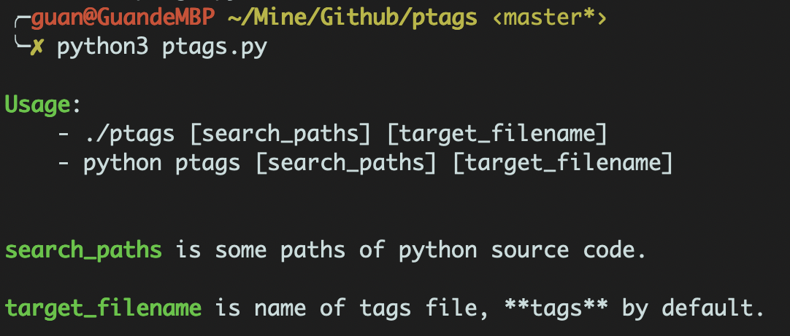
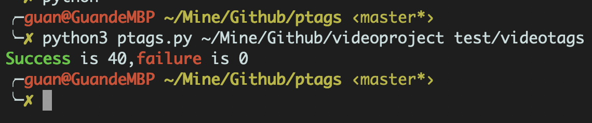
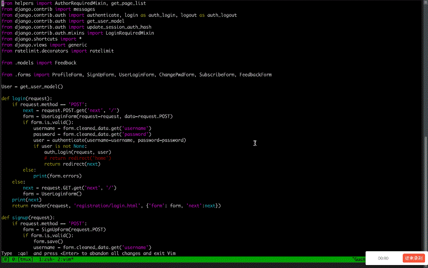

# 说明

此版本的 ptags.py 是基于官方提供的工具脚本 ptags.py 基础之上修改而来的。 

之所以要做这个轮子，是因为操作系统对命令行传参数量有一定的限制。因而使用官方的 ptags.py 时，不能解析全部的 py 文件到一个 tags 文件中。

首先我得承认，官方会做如此处理，一定是有他的道理——我觉得很可能是我对 tags 的用法进入了误区。

然而不管如何，自己暂时没有精力研究 tags 的正确用法。就写这样一个脚本解燃眉之急吧，反正也没有什么不可的。

# 使用

对环境要求：python 3.6 +

命令行：
```bash
./ptags [search_paths] [target_filename]
# or
python ptags [search_paths] [target_filename]
```

# 效果

错误使用时会有 usage 提示。



正确使用后，会有成功解析文件、失败解析文件的个数显示。另外，存在解析失败的文件时，这些文件的全路径会被打印出来。



test 目录下存放的是一个小型项目的 tags 文件，在 vim 中使用效果如下：

